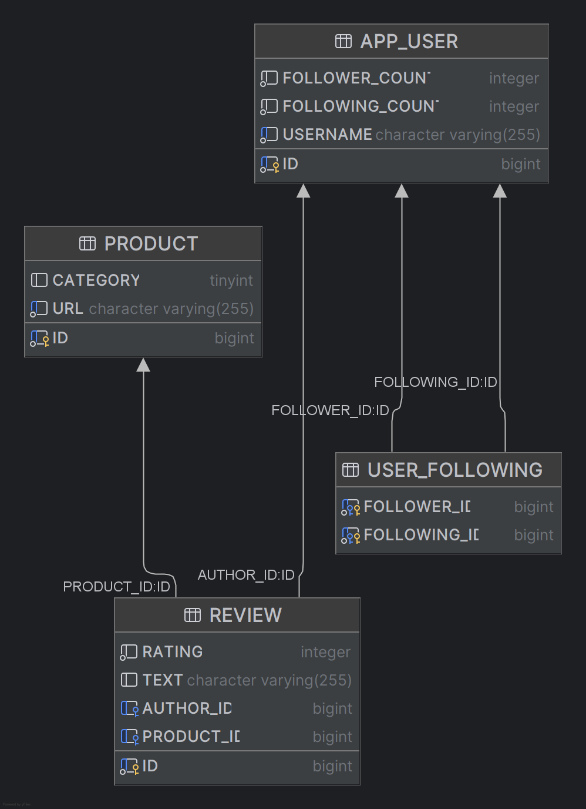
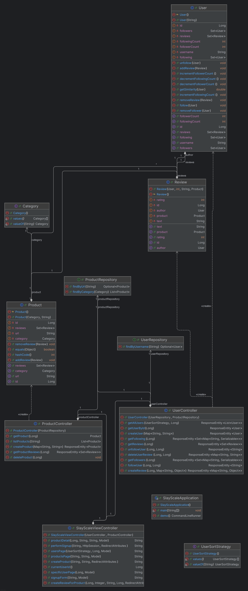

# SlayScale

## Overview 
SlayScale is a social product review platform that allows users to collaboratively review and discover. The system encourages trustworthy and social product discovery through community-driven feedback and network analysis. 

Each product is identified by its online listing link and categorized by type. Users can post reviews with star ratings and comments, follow other users whose opinions they trust, and explore insights such as:
- Products ranked by average rating 
- Most followed and most trusted reviewers
- Reviewer similarity based on Jaccard distance
- Degree of separation between users in the follow network

## Previous Sprint
- Able to create a new user and add a review by making HTTP requests to the backend
- Implemented `User`, `Product`, and `Review` JPA entities, along with `UserController` and `ProductController`, made for RESTful API endpoints
- CRUD operations for products and reviews, including creating a user and adding reviews for users
- Validation and Error Handling: Unit tests for entities and controllers, input validation for URLs, null checks for entities and exception handling
- Added username uniqueness checks and related validation

## Current Sprint
- Added full follow system features, including UI and backend logic for:
  - Following and unfollowing users
  - Viewing followers and following lists
- Added complete review browsing features with UI and backend integration for:
  - Retrieving and filtering all reviews for a given product
  - Retrieving and filtering reviews created by a specific user
- Added product search filtering by name and by category
- Added average rating calculation for products
- Added helper utilities for statistical computations
- Implemented Jaccard Distance similarity between users based on shared reviewed products
- Added AWS Lambda integration for:
  - Notifying a user login via email
  - Environment variable management
  - Updating project dependencies
  - [Click this link for email service repository](https://github.com/AmileshN/SlayScaleEmailService)
- Improved error messages and unified response structure
- Added more robust unit tests for new controller paths, validation logic, and edge cases

## Next Sprint Plan
- Implement a sign-in form for existing users to login
- Implement an SPA to support the client-side

## Database Schema

## UML Diagram
